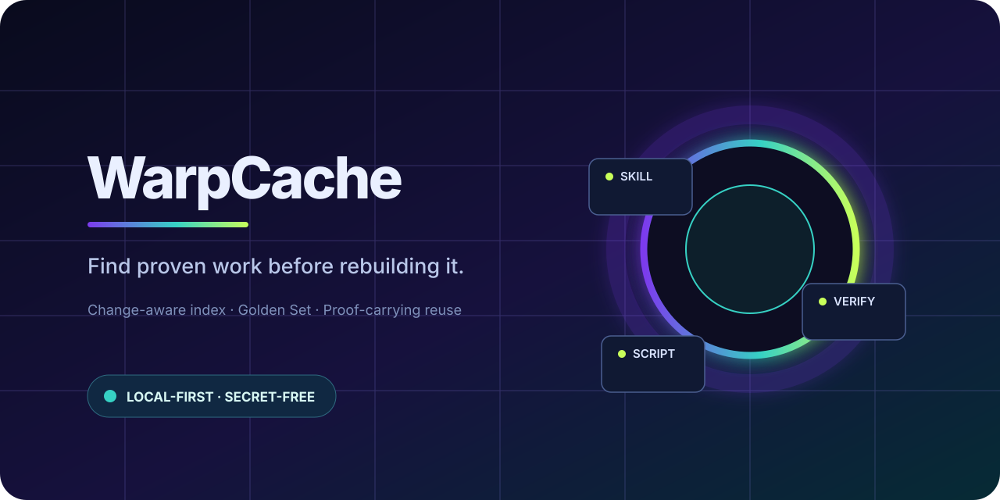

# ⚡ WarpCache

<p align="center">
  
</p>

> **Find proven work before rebuilding it.**

[](#)
[](#principles)
[](#what-it-does)
[](LICENSE)
[](SECURITY.md)

WarpCache is a **local reuse layer** for AI work. It records only safe, regenerable metadata about skills, tools, scripts, and verified artifacts—then returns the canonical path and proof needed to reuse them.

It is **not** a replacement for Hermes, Codex, Claude, Copilot, or Gemini. Each runtime still loads its own native instructions and enforces its own permissions.

```text
canonical source  →  WarpIndex  →  reuse brief  →  native runtime
 skills/tools          fast lookup     pointers       loads & verifies
```

## What it does

| Layer | Benefit | Boundary |
|---|---|---|
| **Change-aware index** | Avoids re-hashing unchanged sources | Source files remain canonical |
| **Reuse brief** | Sends a small, evidence-backed candidate list | Target runtime reloads native content |
| **Proof ledger** | Keeps revision/hash/path with each candidate | No credentials or source-body replication |
| **Golden Set × GraphRAG** | Traverses related work, then admits only verified reusable cases | Mutated source is automatically demoted |
| **Network recipes (optional)** | Captures safe endpoint *shape* for authorized repeat work | HAR/raw secrets are never the cache |

## Measured result

The benchmark is reproducible; see [`docs/benchmark.md`](docs/benchmark.md) and the current [measured result](docs/benchmark-results-2026-08-13.md). It reports both results honestly:

- **Metadata-bound corpus** (many tiny files): cache lookup can be neutral or slower because filesystem `stat`/Python iteration dominates.
- **Byte-bound corpus** (large files): unchanged digest reuse avoids re-reading source bytes, but OS file-cache behavior can still make measured gains neutral; the report—not expectation—decides the claim.

This is an **index refresh** result, not a claim that every Python task or browser session becomes faster.

## Principles

1. **Canonical source wins.** The cache is disposable projection, never source of truth.
2. **Proof before reuse.** Every candidate carries path, revision, and SHA-256.
3. **No cross-runtime config copying.** A brief is a pointer, not an instruction transplant.
4. **No secrets in cache.** Cookies, tokens, authorization values, raw HAR, and response bodies are excluded.
5. **Measure before claiming.** Browser acceleration requires a permitted live endpoint, a paired baseline, and response-equivalence verification.

## Browser lane

Browser direct-request acceleration yields a measured **17.18x speed multiplier** under a local mock PoC simulation. See the test report at [`docs/benchmark-results-2026-08-14.md`](docs/benchmark-results-2026-08-14.md).

## Quick start

```bash
py -3.11 -m pytest
py -3.11 scripts/benchmark.py --files 2000 --bytes-per-file 131072 --runs 5
```

## Repository map

```text
warp_cache/         Core change-aware index
scripts/            Reproducible benchmark runner
tests/              Unit and speed-contract tests
docs/               Benchmark, Golden Set, and safety contracts
assets/             Public repository cover artwork
artifacts/          Generated local benchmark evidence (gitignored)
```

## Default activation

For nontrivial execution work, run the query-only reuse gate before creating new scratch work. It is intentionally skipped for simple Q&A and never triggers a full refresh on its own. See [`docs/default-activation.md`](docs/default-activation.md).

```bash
py -3.11 scripts/warp_cache.py golden-query --query "PPTX screen validation"
```

## Status

- [x] Change-aware source digest reuse
- [x] Reproducible before/after benchmark
- [x] Pointer-only runtime reuse model
- [x] Golden Set gate with GraphRAG reference pointers and stale-source demotion
- [x] Authorized browser direct-request benchmark (implemented and measured at [`docs/benchmark-results-2026-08-14.md`](docs/benchmark-results-2026-08-14.md))

---

Built for repeatable, local-first AI operations.

## Contributing & security

Please read [CONTRIBUTING.md](CONTRIBUTING.md) before submitting changes and [SECURITY.md](SECURITY.md) before reporting a vulnerability.
